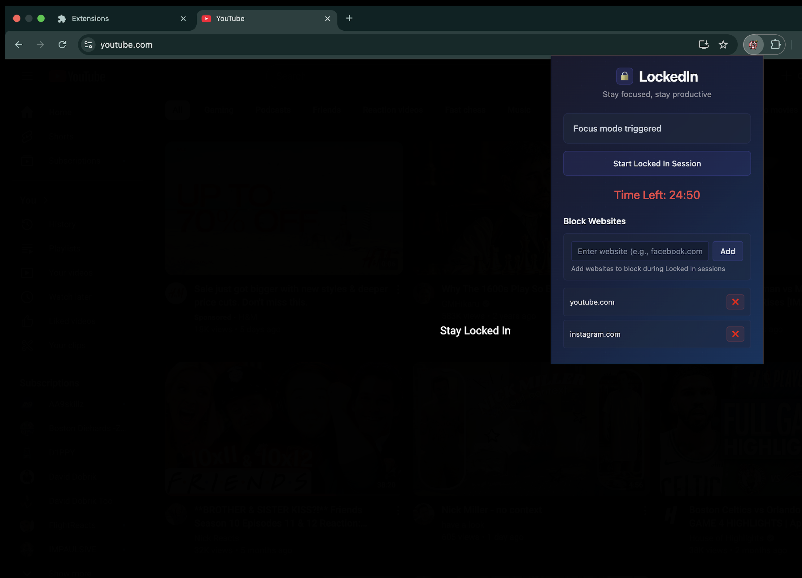

# LockedIN

A simple, pomodoro timer-based Chrome extension that helps you stay focused by blocking distracting websites for a set period of time. Customize your block list, lock yourself in with a single click, and let LockedIn help keep you focused.


---

## Features

- Timer-based "Locked In" sessions (25 minutes)
- Custom list of websites to block
- Fullscreen overlay reminds you to stay focused
- Focus state persists across tab reloads and navigation

---

## Setup & Installation

1. Clone or download this repository:
   ```bash
   git clone https://github.com/krishmajumdar12/LockedIn.git
   cd LockedIn
   ```

2. Open **Google Chrome** and navigate to: chrome://extensions

3. In the top-right corner, enable **Developer mode**

4. Click **Load unpacked** and select the folder where you cloned this project

5. The **LockedIN** extension should now appear in your toolbar

---

## How to Use

1. Click the **LockedIN** icon in your toolbar to open the popup.

2. Under the **Block Websites** section, add any websites you want to restrict during focus time.
   - Format: just the domain (e.g. `youtube.com`, `instagram.com`)
   - You can remove sites from the list at any time using the ❌ button.

3. Click the **"Start Focus Mode"** button to begin a **25-minute session** (session cannot be ended once started until timer expires).
   - A countdown timer will appear in the popup.
   - The **Start** button becomes disabled to prevent early exit.

4. While focus mode is active:
   - Any tab that matches a blocked site will be covered by a fullscreen overlay reminding you to stay focused.
   - You can still browse other (non-blocked) sites freely.

5. Once the timer reaches zero:
   - Focus mode will automatically end.
   - The overlay disappears (refresh if needed).
   - You can start another session whenever you're ready.

---

## License

This project is for **personal use only** and is **not currently open source**.

---

## Contributing

Contributions and pull requests are not accepted at this time.

---

## Contact

For questions or feedback, please contact krishmajumdar12@gmail.com.

---